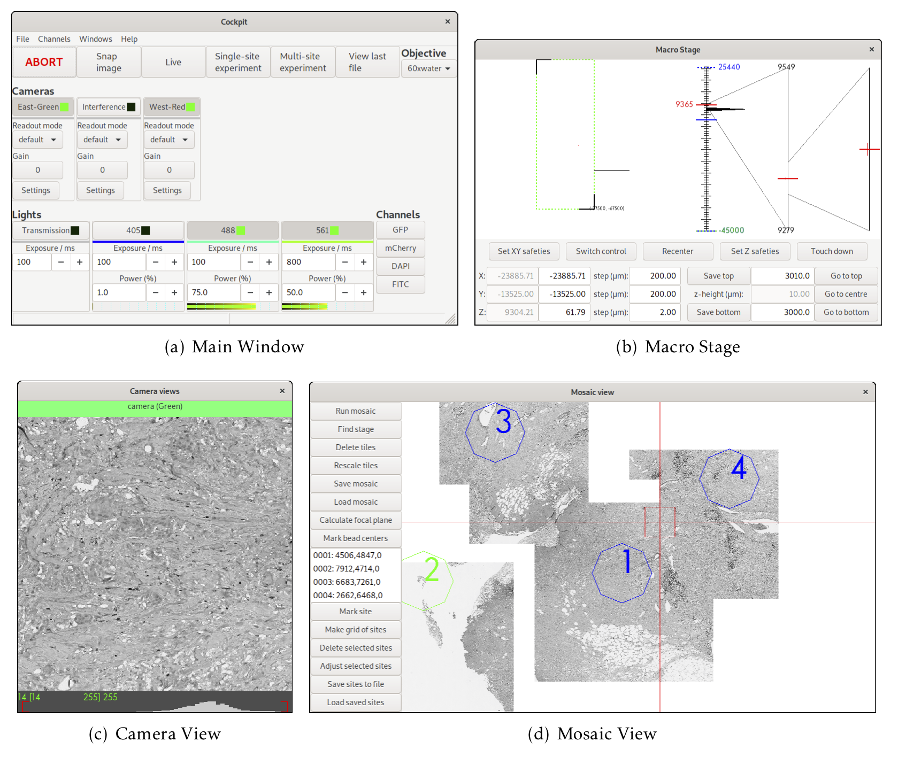

.. image:: https://zenodo.org/badge/14752681.svg
   :target: https://zenodo.org/badge/latestdoi/14752681

Microscope-Cockpit
==================

.. image:: cockpit/resources/images/cockpit.ico
  :width: 400
  :align: center
  :alt: Cockpit Icon

Cockpit is a microscope graphical user interface.  It is a flexible
and easy to extend platform aimed at life scientists using bespoke
microscopes.  More detailed information is available:

- in the `Online documentation
  <https://www.micron.ox.ac.uk/software/cockpit/>`__

- on the `Micron Oxford websitee
  <https://micronoxford.com/python-microscope-cockpit>`__

- in the recently published `bioRxiv paper
  <https://www.biorxiv.org/content/10.1101/2021.01.18.427178v1>`__

Main Features
--------------

- **Easy to use and extend by life scientists:** Cockpit is completely
  written in Python and meant to be extended by the user.

- **Independent of the actual devices being used:** Cockpit uses
  Python's `Microscope package <https://www.python-microscope.org>`__
  to control the devices.  The graphical interface and experiments
  automatically adjust to the existing devices.

- **Very fast device control and time precision:** During experiments,
  devices are controlled via hardware signals.

- **Cross Platform:** Cockpit runs on GNU/Linux, Mac, and Windows.

- **FOSS:** Cockpit is free and open source software, released under
  the GPL.

The User Interface
------------------

The user interface is made up of a number of windows with the main
ones shown below.

Citation
--------

If you find this project useful, please cite:

    Phillips MA, Susano Pinto DM, Hall N *et al*. Microscope-Cockpit:
    Python-based bespoke microscopy for bio-medical science. Wellcome
    Open Res 2021, **6**:76
    (`https://doi.org/10.12688/wellcomeopenres.16610.1
    <https://doi.org/10.12688/wellcomeopenres.16610.1>`__)
